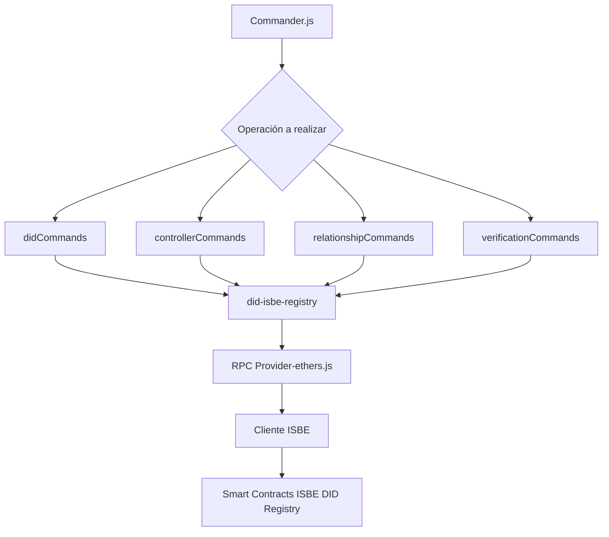

# ISBE-ART-00005 — ISBE DID Registry CLI

## (artefactos/apps/isbe-identity-did-cli)

## 1. Identificación del Artefacto

| Campo                     | Valor                                                                                       |
| ------------------------- | ------------------------------------------------------------------------------------------- |
| **Nombre del artefacto**  | ISBE-ART-00005 — ISBE DID Registry CLI                                                      |
| **Origen**                | Proyecto ISBE – Capa de Identidad / Implementación CLI sobre el Smart Contract DID Registry |
| **Estado**                | Validado                                                                           |
| **Versión del documento** | 1.0.0                                                                                       |
| **Fecha**                 | 2025-12-01                                                                                  |
| **Repositorio**           | https://github.com/alastria/isbe-identity-did-cli/tree/main                                                   |
| **Commit**                | _(pendiente)_                                                                               |

---

## 2. Propósito del Artefacto

### Objetivo funcional

La CLI del ISBE DID Registry es la herramienta oficial para la administración técnica de identidades descentralizadas del método `did:isbe` directamente sobre la blockchain.

### Permite

- Crear DIDs raíz y secundarios.
- Administrar _controllers_.
- Registrar, rotar, expirar y revocar **Verification Methods**.
- Crear relaciones de verificación (`authentication`, `assertionMethod`, `keyAgreement`, etc.).
- Consultar el DID Document actual e histórico.
- Gestionar alias (on-chain y off-chain).
- Mantener almacenamiento local seguro de identidades.

### Beneficios para ISBE

- **Estandarización operativa:** todos los equipos usan los mismos comandos y procedimientos.
- **Auditabilidad:** todas las operaciones quedan registradas on-chain.
- **Automatización:** puede integrarse en scripts, pipelines DevOps y herramientas internas.
- **Interoperoperabilidad:** los datos generados siguen el estándar DID Core.
- **Alineación normativa:** eIDAS2, RGPD, ENS Capa de Identidad Digital.

### Stakeholders Clave

- Squads ISBE (Identity, Registry, Onboarding, Wallet).
- Integradores externos.
- Administradores de claves institucionales.
- Proveedores de identidad y wallets.
- Auditores técnicos.
- Arquitectura corporativa.

## 3. Alcance y Ciclo de Vida

| Fase                  | Estado     |
| --------------------- | ---------- |
| Diseño funcional      | Completado |
| Diseño técnico        | Completado |
| Implementación        | Completado |
| Pruebas manuales      | Completado |
| Pruebas automatizadas | Parcial    |
| Mantenimiento         | Activo     |
| Documentación         | Incluida   |

## Dependencias técnicas

- Node.js >= 18
- TypeScript 5.x
- ethers.js v6
- did-isbe-registry-dev
- Red blockchain EVM
- Smart Contract ISBE DID Registry
- API REST opcional (para resolución externa, no requerida por la CLI)

---

## 4. Definición del Artefacto

### 4.1. Arquitectura de referencia

### Componentes internos

| Componente                 | Descripción                                    |
| -------------------------- | ---------------------------------------------- |
| `commands/document.ts`     | Lógica para crear, actualizar y consultar DIDs |
| `commands/relationship.ts` | Gestión de Verification Methods                |
| `commands/controller.ts`   | Gestión de controllers                         |
| `commands/verification.ts` | Relaciones de verificación                     |
| `.dids.json`               | Almacenamiento local de DIDs creados           |
| `.did_root`                | Almacenamiento seguro del Root DID y su clave  |

---

### 4.2. Trazabilidad

El artefacto implementa los siguientes requisitos:

| Requisito                        | Cumplimiento |
| -------------------------------- | ------------ |
| Crear DID Root                   | ok           |
| Crear DID Secundario             | ok           |
| Registrar claves de verificación | ok           |
| Rotación de claves               | ok           |
| Revocación de claves             | ok           |
| Gestión de controllers           | ok           |
| Relaciones de verificación       | ok           |
| Consulta histórica               | ok           |
| Alias on/off-chain               | ok           |

**Alineado con:**

- DID Core (W3C)
- ISBE DID Method Specification
- eIDAS2 – Identidad Digital Europea
- Arquitectura ISBE Capa 1 - Identidad

## 4.3. Descripción funcional detallada

### 4.3.1. Gestión de DIDs

#### Comandos principales

| Comando                | Función                                               |
| ---------------------- | ----------------------------------------------------- |
| `init`                 | Inicializa el DID Registry creando el primer Root DID |
| `create-root`          | Crea un DID raíz nuevo                                |
| `createSecondary`      | Crea un DID secundario controlado por un DID raíz     |
| `update-base`          | Modifica el Base Document del DID                     |
| `update-alias`         | Actualiza alias off-chain                             |
| `update-alias-onchain` | Actualiza el campo `alsoKnownAs` en el contrato       |

#### Comportamiento

- Los DIDs raíz se derivan de una clave privada inicial.
- Los DIDs secundarios se derivan de claves firmadas por el root.
- Todas las operaciones se firman con el root actual (almacenado en `.did_root`).

---

### 4.3.2. Verification Methods

#### Funciones soportadas

| Acción   | Descripción                                      |
| -------- | ------------------------------------------------ |
| `add`    | Registra un nuevo VM                             |
| `revoke` | Marca un VM como revocado                        |
| `expire` | Ajusta `notAfter`                                |
| `roll`   | Rota clave → expira la anterior y crea una nueva |

#### Observaciones técnicas

- Los _fragments_ se generan con un hash truncado en Base58.
- Los VM revocados siguen existiendo on-chain (solo cambian metadatos).
- La CLI asegura que los VM son válidos antes de usarse en relaciones.

---

### 4.3.3. Verification Relationships

Ejemplos de relaciones soportadas:

- `authentication`
- `assertionMethod`
- `capabilityInvocation`
- `capabilityDelegation`
- `keyAgreement`

La CLI permite:

- Crear relaciones
- Listar relaciones por DID
- Búsqueda inversa: obtener todos los DIDs que usan un VM en una relación concreta

---

### 4.3.4. Controllers

Funciones soportadas:

- Añadir controller
- Revocar controller
- Verificar controller
- Buscar DIDs controlados por un DID raíz

Los controllers permiten custodiar múltiples identidades.

---

### 4.3.5. Consulta y resolución

| Comando                | Función                                               |
| ---------------------- | ----------------------------------------------------- |
| `get-did`              | Consulta estado actual del DID (on-chain + off-chain) |
| `get-did-by-timestamp` | Consulta histórica por timestamp                      |
| `list`                 | Muestra DIDs almacenados en `.dids.json`              |

La CLI **no usa API REST**, a diferencia del Resolver TS.

---

## 4.4. Modelos o diagramas específicos

(Sugeridos para el documento formal)

- Diagrama de secuencia: creación de VM
- Diagrama de flujo: _roll_ de VM
- Diagrama ER del estado on-chain del DID Registry
- Diagrama de arquitectura: CLI → librería → RPC → contrato

## 4.5. Reglas de negocio asociadas

### Reglas

| Área            | Regla                                             |
| --------------- | ------------------------------------------------- |
| Controladores   | Solo el controller puede modificar un DID         |
| VM              | Deben tener `publicKeyHex` válida                 |
| Relaciones      | Deben vincularse con VM existentes y no revocados |
| Tiempos         | `notAfter` > `notBefore` siempre                  |
| Alias on-chain  | Solo hay uno por DID                              |
| Alias off-chain | Múltiples actualizaciones permitidas              |

---

## 4.6. Interfaces de integración

**Interfaces públicas**

- CLI (Commander.js)
- Smart Contract ISBE DID Registry
- Librería `did-isbe-registry-dev`

**APIs externas**

No aplica.
(El resolver REST es otro artefacto: **ISBE-ART-00001**.)

---

## 4.7. Normativas y requisitos regulatorios

- eIDAS2 — Identidad digital europea
- GDPR / RGPD — Tratamiento de datos personales
- W3C DID Core 1.0
- ENS ISBE – Capa 1 Identidad Digital

---

## 4.8. Criterios de calidad

- Transacciones firmadas localmente
- Validación estricta de parámetros
- Compatibilidad total con ethers.js v6
- Mensajes consistentes en CLI
- Logs claros de blockchain
- Persistencia robusta en archivos locales

---

# 5. Desarrollo del Artefacto

## 5.1. Componentes principales

| Archivo                              | Función                            |
| ------------------------------------ | ---------------------------------- |
| `src/commands/document.ts`           | Crear / actualizar / resolver DIDs |
| `src/commands/relationship.ts`       | VM y roll / revoke / expire        |
| `src/commands/controller.ts`         | Gestión de controllers             |
| `src/commands/verification.ts`       | Relaciones de verificación         |
| `src/utils/isRegistryInitialized.ts` | Inicialización                     |
| `src/utils/localStorage.ts`          | Manejo de `.dids.json`             |
| `.did_root`                          | Root wallet persistido             |

---

## 5.2. Elementos producidos

| Componente         | Descripción                            |
| ------------------ | -------------------------------------- |
| Código fuente      | Implementación completa en TypeScript  |
| CLI                | Binario ejecutable vía `npx tsx`       |
| Librerías internas | `did-isbe-registry-dev`                |
| Manual de uso      | Este documento                         |
| Scripts operativos | `init`, `create-root`, `roll-vm`, etc. |
| Persistencia       | `.dids.json` y `.did_root`             |

---

## 5.3. Frameworks y librerías

- Node.js v18+
- TypeScript v5.x
- ethers.js v6
- commander.js
- did-isbe-registry-dev
- dotenv
- noble-hashes
- bs58

---

## 5.4. Buenas prácticas aplicadas

- Validación de entradas
- Logging consistente con **chalk**
- Transacciones firmadas correctamente
- Sin dependencias inseguras
- Estructura modular
- Código idempotente

---

## 5.5. Criterios de validación

| Test                   | Resultado esperado                    |
| ---------------------- | ------------------------------------- |
| Crear DID root         | DID válido creado                     |
| Crear DID secundario   | Correctamente insertado en blockchain |
| `add-vm`               | VM añadido con fragment único         |
| `roll-vm`              | Nuevo VM + expiración del anterior    |
| `add-verification-rel` | Relación válida creada                |
| `get-did`              | Documento unificado                   |
| `get-did-by-timestamp` | Estado histórico coherente            |

---

## 5.6. Alineación legal

- Minimización de datos (solo claves)
- No almacena datos personales salvo alias opcional
- Claves y documentos se procesan localmente

---

## 5.7. Dependencias de infraestructura

- Nodo RPC
- Smart Contract DID Registry
- Permisos de escritura en el sistema local

---

## 5.8. Limitaciones

- Solo método `did:isbe`
- Requiere conexión RPC
- Requiere wallet EVM
- No resuelve vía API (para eso está ISBE Resolver)

---

## 5.9. Limitaciones por versiones

- ethers.js v6 incompatible con v5
- Node <18 no soportado

---

# 6. Reglas de Control y Actualización

| Tipo de cambio | Versionado | Aprobación        | Documentación      |
| -------------- | ---------- | ----------------- | ------------------ |
| Menor          | X.Y+1      | PR interno        | Release notes      |
| Mayor          | X+1.0      | Comité técnico    | Informe de impacto |
| Hotfix         | X.Y.Z+1    | Aprobación rápida | Pruebas mínimas    |

---

**Copyright © 2025 Comunidad de Madrid & Alastria**
